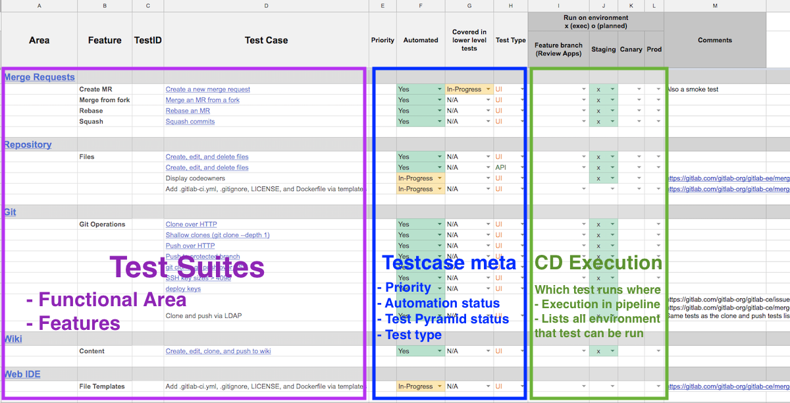

## On this page
{:.no_toc}

- TOC
{:toc}

# Test Engineering Process

The Quality team leads the test planning for all things related to Engineering work. 

### Test Plan

* The test plan is essentially the test requirement linked to the product requirement.
* The test plan is the place to plan Quality and Risk management on how to achieve optimal test coverage across all test levels when delivering a change/feature.
* Output or deliverable of the test plans are:
  * Signed off End-to-end test scenarios, which will be automated and documented in [GitLab Blackbox Integration & E2E Test Coverage] sheet. 
  * Expectation on integration test coverage.
  * Expectation on unit test coverage.
  * One-off manual testing as needed (ideally this should be at a minimal and only required for adhoc/exploratory testing)

GitLab Quality Test plan is based on [Google’s 10 min test plan](https://testing.googleblog.com/2011/09/10-minute-test-plan.html.md). 
This team plan uses the ACC Framework (Attribute, Components and Capabilities matrix)
* Attributes: qualities the product should have
* Components: major parts of the product
* Capabilities: behavior the product should display that links components and attributes

Currently we have a [test plan template](https://gitlab.com/gitlab-org/gitlab-ce/blob/master/.gitlab/issue_templates/Test%20plan.md) that is available for test planning in GitLab CE & EE.  

You can see the all the existing test plans here:
* [GitLab CE Test Plans](https://gitlab.com/gitlab-org/gitlab-ce/issues?scope=all&utf8=%E2%9C%93&state=opened&label_name[]=test%20plan/index.html.md)
* [GitLab EE Test Plans](https://gitlab.com/gitlab-org/gitlab-ee/issues?scope=all&utf8=%E2%9C%93&state=opened&label_name[]=test%20plan/index.html.md)

#### Security

In addition to Quality, Security is also our top concern. It is expected that with every change and every new feature we need to factor in security risks and mitigate them early in the development process.

The test plan template has a risk column dedicated to Security. The following should be the top priority while assessing risk in Security.

* Exposure of user confidential information.
* Exposure of access; authentication, token.

### Test Coverage Tracking

The Quality team is currently tracking all the test coverage in [GitLab Blackbox Integration & E2E Test Coverage] sheet.

An explanation of why we chose to do it this way is explained in this issue: [Test case management and test tracking in a Native Continuous Delivery way](https://gitlab.com/gitlab-org/gitlab-ce/issues/51790/index.html.md).

To summarize, we want to track out tests in a Native Continuous Delivery way.
* If we are doing continuous delivery in the right way, there should be little to no manual tests. Manual tests if any should be minimal and exploratory.
* There should be little need for detailed test steps if manual testing is minimal and exploratory.
  * Exploratory testing has a free form emphasis which removes the importance of hardcoded test steps. 
  * The disadvantage of going into too much detail with hardcoded test steps is we are not able to catch bugs outside the hardcoded flow in the document, it's also a high maintenance document. 
  * Our test case name / description contains just enough description, this helps fuzzes the workflow up and we end up catching more critical bugs this way.
* An emphasis on risk-based test planning using the ACC framework.
* An emphasis on categorizing test automation types which tracks the pyramid shape (API, UI, and Visual).
* An emphasis on tracking alignment in the lower test levels in the pyramid.

An overview of the test management view is shown below.

### Test Planning Process

* At release kickoff test plans are created by the Quality / Test Automation Engineer who is assigned to a product area. 
* Test strategy is then discussed and collaborated with clear test deliverable and coverage expectation.
* Each team members is responsible for completing the test deliverable.
* Quality / Test Automation Engineers ensure that we complete the test coverage as planned before the feature is merged into `master` and released to production.

Everyone in engineering is expected to contribute to Quality and keep our test pyramid in top shape.
For every new feature we aim to ship a new slice of the pyramid so we don't incure test automation debt.
This is what enables us to do Continous Delivery.

[GitLab Blackbox Integration & E2E Test Coverage]:https://docs.google.com/spreadsheets/d/1RlLfXGboJmNVIPP9jgFV5sXIACGfdcFq1tKd7xnlb74/edit